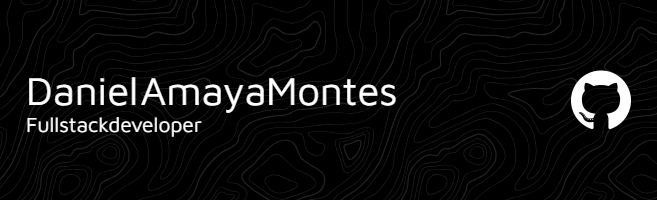

  

___

### **🚀 ¿Quién soy?**  
¡Desarrollador de experiencias web que unen personas con soluciones! 🌐

Desde Spring Boot hasta React, estoy constantemente explorando nuevas tecnologías para construir aplicaciones poderosas y altamente funcionales. Cada línea de código que escribo es una oportunidad para innovar y aprender.

✨ ¡La tecnología no para de evolucionar, y yo tampoco!
___

### **Frontend:** 

    

### **Backend:** 

    

### **DevOps y Herramientas:** 

    

---

 
### **¿Qué hago ahora?** 

 
💡 Spring Boot: Creando backend eficientes para aplicaciones modernas.

🎨 React: Transformando interfaces de usuario en experiencias interactivas y fluidas.

📚 Mejores prácticas en desarrollo web: Optimizando cada detalle para ofrecer soluciones de alta calidad.

---

✨ Buscando siempre el próximo reto para seguir creciendo y creando soluciones impactantes. ¡Vamos juntos a la cima! 🌟
